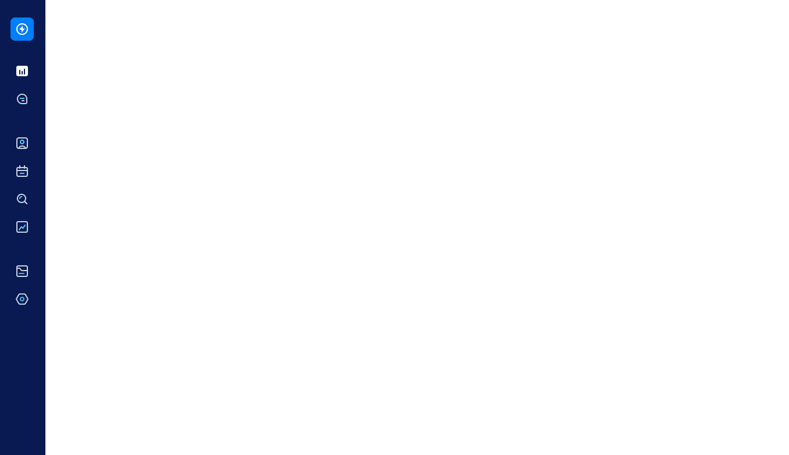

# Modelo de sidebar utilizando React e tailwind css

Além do menu, também foi aplicado um efeito de opacity para o restante do conteudo em tela, para quando o menu estiver aberto, dando uma sensação de profundidade

O modelo foi retirado do seguinte vídeo:
<a href="https://youtu.be/aMjou4yXWdU">Code a Program</a>
